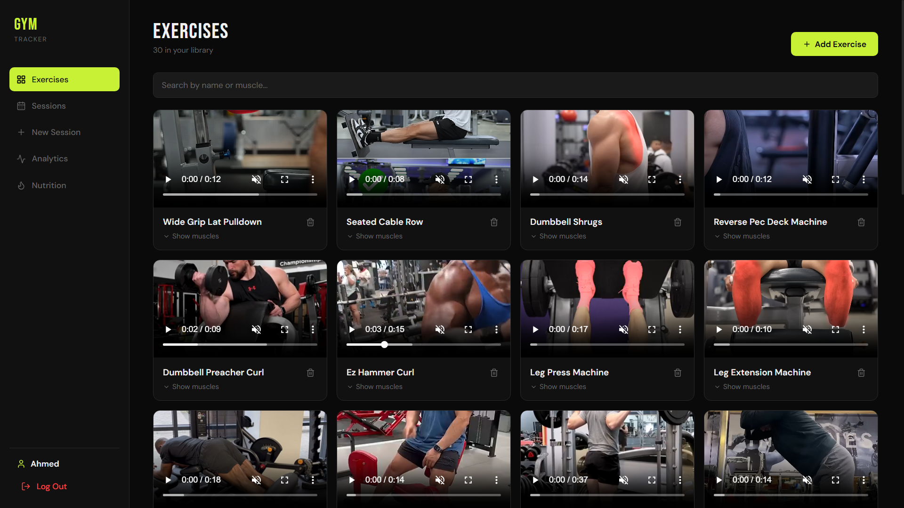
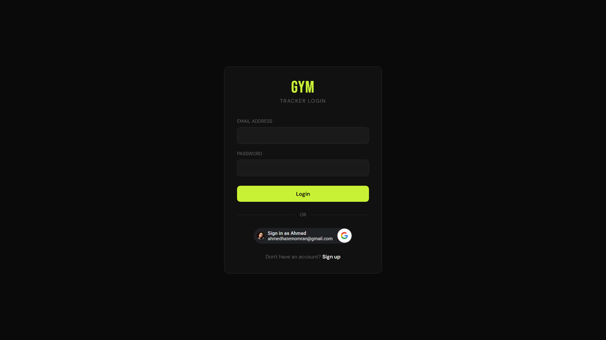
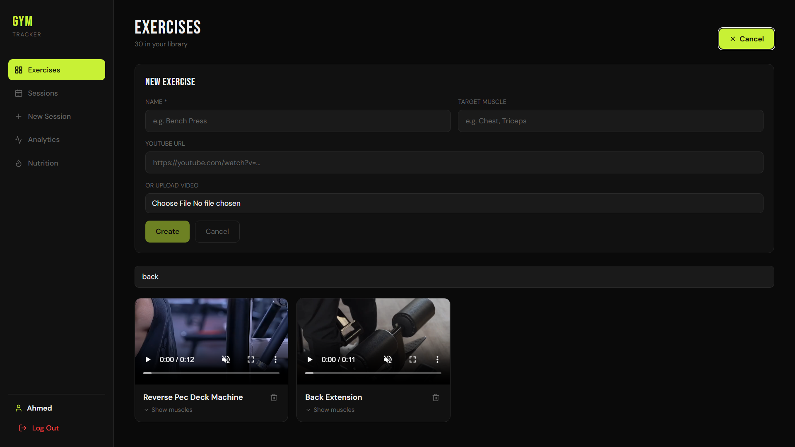
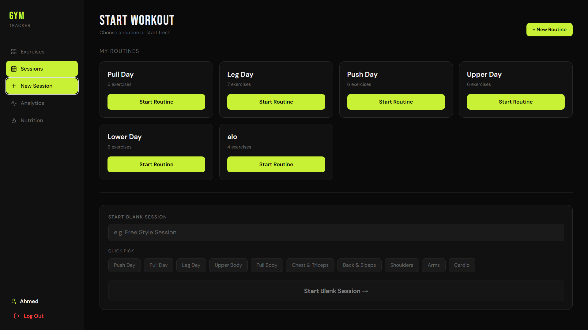
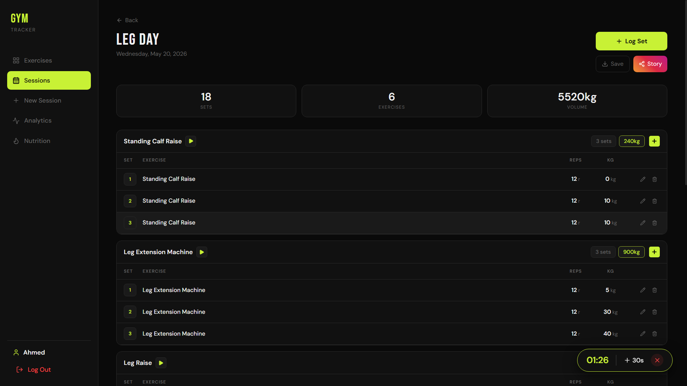
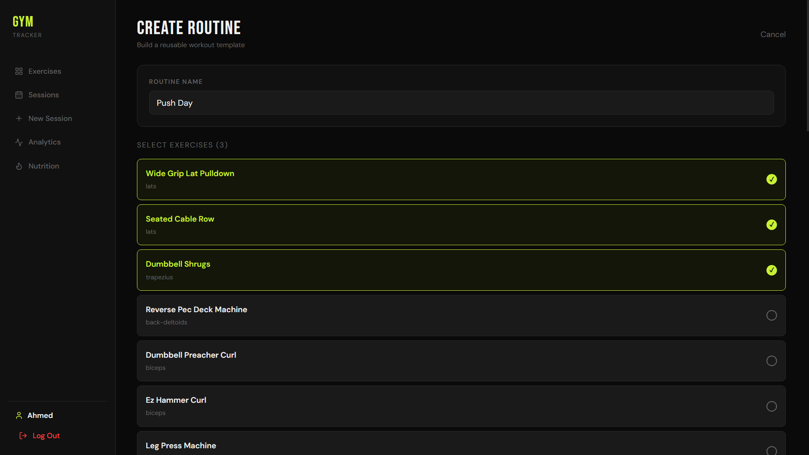
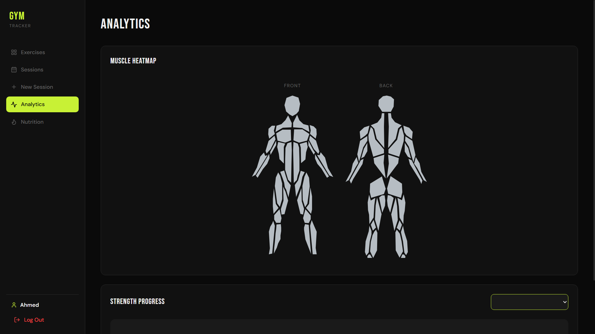
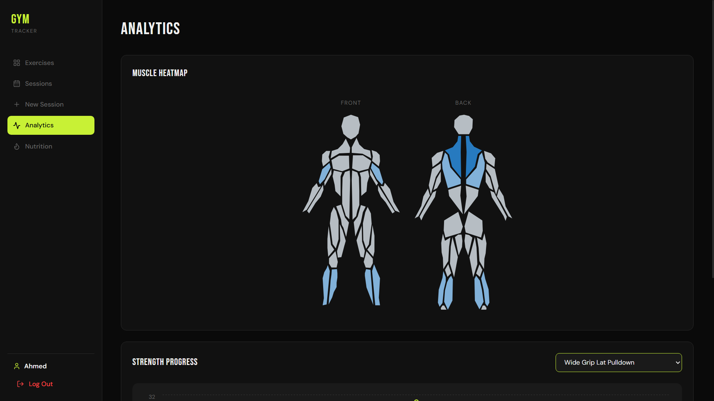
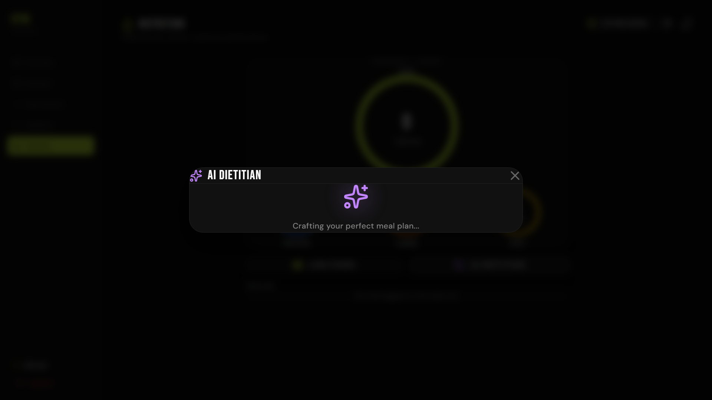
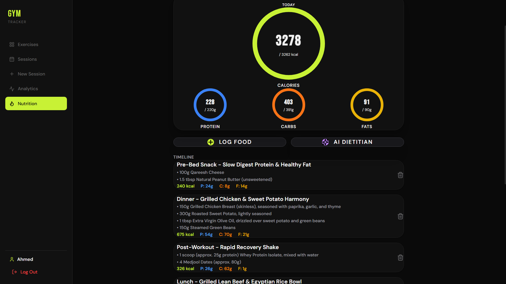

<p align="center">
  
</p>

<h1 align="center">🏋️ Gym Diary</h1>

<p align="center">
A production-ready Full Stack Fitness Tracking platform built with <b>React</b>, <b>Django REST Framework</b>, and <b>PostgreSQL</b>.
Track workouts, monitor progress, analyze performance, manage nutrition, and generate personalized AI meal plans.
</p>

<p align="center">

<a href="https://gym-tracker-app-eight.vercel.app">

</a>

<a href="https://github.com/ahmed22981/gym_tracker_app">

</a>


</p>

---

# 📖 Overview

Gym Tracker is a modern full-stack fitness platform that helps users organize workouts, monitor strength progression, track nutrition, and receive AI-powered meal recommendations.

The application focuses on providing a clean user experience while maintaining a scalable backend architecture built with Django REST Framework and JWT authentication.

---

# ✨ Features

###  Authentication

- JWT Authentication
- Google OAuth Login
- Protected Routes
- Persistent Login
- Secure REST APIs

---

###  Workout Management

- Create Exercise Library
- Search by Exercise Name
- Search by Target Muscle
- Upload Exercise Videos
- Video Preview
- Create Workout Sessions
- Edit Workout Logs
- Delete Exercises
- Track Sets, Reps & Weight

---

###  Analytics

- Workout Progress Charts
- Personal Records Tracking
- Interactive Charts
- Muscle Heatmap
- Exercise Progress History

---

###  Nutrition Tracking

- Daily Nutrition Dashboard
- Calories Tracking
- Protein Tracking
- Carbohydrates Tracking
- Fat Tracking
- Daily Nutrition Summary
- Custom Meals
- Saved Meals

---

###  AI Nutrition Assistant

Generate personalized meal plans using **Google Gemini AI** based on:

- Goal
- Weight
- Height
- Activity Level
- Target Calories
- Daily Macros

Users can generate an AI meal plan and instantly save it into their nutrition log.

---

###  Smart Features

- Automatic Macro Calculator
- BMR Calculation
- TDEE Calculation
- Goal-based Calories
- Workout Templates
- Session Auto Population
- Exercise Search
- Cloud Video Storage

---

# 🛠 Tech Stack

## Frontend

- React 19
- TypeScript
- Vite
- React Router
- Axios
- Tailwind CSS
- Recharts
- SweetAlert2

---

## Backend

- Django
- Django REST Framework
- SimpleJWT
- Google OAuth
- Google Gemini AI
- Cloudinary

---

## Database

- PostgreSQL
- Neon Database

---

## Deployment

| Service | Platform |
|----------|----------|
| Frontend | Vercel |
| Backend | Render |
| Database | Neon |
| Media Storage | Cloudinary |

---

# 🏗 System Architecture

```text
               React + TypeScript
                       │
                       │ REST API
                       ▼
          Django REST Framework
                       │
     ┌─────────────────┼─────────────────┐
     ▼                 ▼                 ▼
 PostgreSQL        Cloudinary      Gemini AI
    (Neon)           Videos         Meal Plans
```

---

# 📷 Application Screenshots

## Login

<p align="center">

</p>

---

## Exercise Library

Search exercises by name or target muscle and manage your exercise collection.

<p align="center">

</p>

---

## Create Workout Session

Quickly create a new workout session and organize your exercises.

<p align="center">

</p>

---

## Workout Session

Track sets, reps, weight, and monitor your progress during every workout.

<p align="center">

</p>

---

## Workout Templates

Create reusable workout routines to start future sessions with a single click.

<p align="center">

</p>

---

## Analytics Dashboard

Analyze your workout history using interactive charts.

<p align="center">

</p>

---

## Muscle Heatmap

Visualize the muscles you've trained over the last month.

<p align="center">

</p>

---

## Nutrition Dashboard

Track calories, protein, carbohydrates, and fats throughout the day.

<p align="center">

</p>

---

## AI Meal Generator

Generate a complete personalized meal plan powered by Google Gemini AI.

<p align="center">

</p>

---

## Generated AI Meal Plan

Save the generated meal plan directly into your nutrition log.

<p align="center">

</p>

---

# 🚀 Core Functionalities

- Authentication with JWT & Google OAuth
- Exercise Management
- Workout Session Tracking
- Workout Templates
- Progress Analytics
- Muscle Heatmap Visualization
- Nutrition Tracking
- AI Meal Generation
- Responsive UI
- Cloud-based Video Storage
- Production Deployment

# 📂 Project Structure

```
gym_tracker
│── config
│   ├── settings.py
│   ├── urls.py
│
│ 
├── assets
│   ├── hero.png
│   ├── login.png
│   ├── exercises.png
│   ├── sessions.png
│   ├── analytics.png
│   ├── heatmap.png
│   ├── nutrition.png
│   ├── ai-generation.png
│   ├── ai-meal-plan.png
│   ├── templates.png
│   └── new-session.png
│
├── frontend
│   ├── src
│   ├── public
│   ├── package.json
│   └── vite.config.ts
│
├── workouts
│   ├── models.py
│   ├── views,py
│   ├── serializers.py
│   
├── requirements.txt
├── manage.py
│
└── README.md
```

---

# ⚙️ Getting Started

## 1️⃣ Clone the Repository

```bash
git clone https://github.com/ahmed22981/gym_tracker_app.git

cd gym_tracker_app
```

---

# 🖥 Backend Setup

Create a virtual environment

### Windows

```bash
python -m venv venv

venv\Scripts\activate
```

### Linux / macOS

```bash
python3 -m venv venv

source venv/bin/activate
```

Install dependencies

```bash
pip install -r requirements.txt
```

Run migrations

```bash
python manage.py migrate
```

Start the backend server

```bash
python manage.py runserver
```

Backend runs on

```
http://localhost:8000
```

---

# 💻 Frontend Setup

Open another terminal

```bash
cd frontend
```

Install packages

```bash
npm install
```

Start Vite

```bash
npm run dev
```

Frontend runs on

```
http://localhost:5173
```

---

# 🔑 Environment Variables

## Backend (.env)

Create a file named

```
backend/.env
```

```env
DEBUG=False

DATABASE_URL=your_database_url

DIRECT_DATABASE_URL=your_direct_database_url

SECRET_KEY=your_secret_key

GOOGLE_CLIENT_ID=your_google_client_id

CLOUDINARY_CLOUD_NAME=your_cloud_name

CLOUDINARY_API_KEY=your_api_key

CLOUDINARY_API_SECRET=your_api_secret

GEMINI_API_KEY=your_gemini_api_key
```

---

## Frontend Development

Create

```
frontend/.env.development
```

```env
VITE_API_URL=http://localhost:8000/api

VITE_GOOGLE_CLIENT_ID=your_google_client_id
```

---

## Frontend Production

Create

```
frontend/.env.production
```

```env
VITE_API_URL=https://your-render-backend-url/api

VITE_GOOGLE_CLIENT_ID=your_google_client_id
```

---

# 🔌 REST API Overview

## Authentication

```
POST /api/register/

POST /api/login/

POST /api/google/

POST /api/token/refresh/
```

---

## Exercises

```
GET /api/exercises/

POST /api/exercises/

DELETE /api/exercises/{id}/
```

---

## Workout Sessions

```
GET /api/sessions/

POST /api/sessions/

GET /api/sessions/{id}/
```

---

## Workout Logs

```
GET /api/logs/

POST /api/logs/

PATCH /api/logs/{id}/
```

---

## Workout Templates

```
GET /api/templates/

POST /api/templates/

POST /api/templates/{id}/start/
```

---

## Analytics

```
GET /api/analytics/heatmap/

GET /api/exercises/{id}/progress/
```

---

## Nutrition

```
GET /api/nutrition/logs/

POST /api/nutrition/logs/

GET /api/nutrition/summary/

GET /api/nutrition/generate-ai-plan/

POST /api/nutrition/save-ai-plan/
```

---

# ☁️ Deployment

| Service | Platform |
|----------|----------|
| Frontend | Vercel |
| Backend | Render |
| Database | Neon PostgreSQL |
| Media Storage | Cloudinary |
| AI | Google Gemini |

---

# 🚀 Highlights

✅ JWT Authentication

✅ Google OAuth

✅ Django REST Framework

✅ React 19 + TypeScript

✅ PostgreSQL

✅ Interactive Charts

✅ AI Meal Generator

✅ Nutrition Tracking

✅ Workout Templates

✅ Responsive Design

✅ Cloudinary Media Storage

✅ Production Deployment

---

# 📈 Future Improvements

- Push Notifications

- Progressive Web App (PWA)

- Social Features

- Workout Sharing

- Personal Records Dashboard

- Dark / Light Theme

- Apple Health Integration

- Smart Watch Integration

- Docker Support

- CI/CD Pipeline

---

# 👨‍💻 Author

## Ahmed Hatem Omran

Software Engineer

📧 Email

```
ahmedhatemomran@gmail.com
```

💼 LinkedIn

```
https://www.linkedin.com/in/ahmed-omran-310a91317/
```

🌐 Portfolio

```
https://ahmed-omran-portfolio.vercel.app/
```

🐙 GitHub

```
https://github.com/ahmed22981
```

---

# ⭐ If you like this project

Give it a ⭐ on GitHub!

It helps others discover the project and motivates future improvements.

---

<p align="center">

Built with React, Django REST Framework, PostgreSQL, and Google Gemini AI.

</p>
